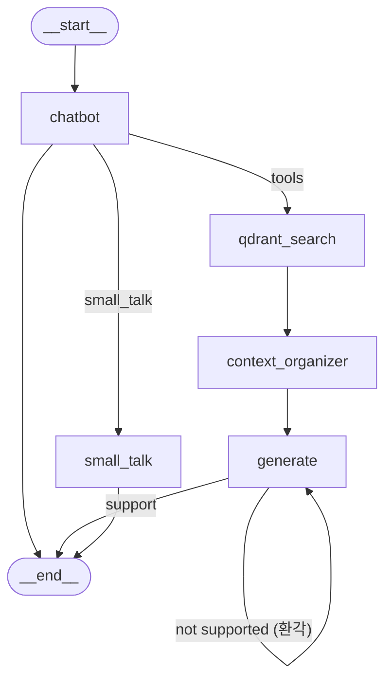

# Shopping Assistant — AI 쇼핑 어시스턴트

> **텍스트 · 이미지 멀티모달 검색**을 지원하는 RAG 기반 쇼핑 챗봇입니다.  
> 사용자가 텍스트로 상품을 검색하거나, 이미지를 업로드하면 유사한 상품을 찾아 추천하고  
> 자연어로 친절하게 안내합니다.

---

## 목차

1. [프로젝트 설명](#프로젝트-설명)
2. [기술 스택](#기술-스택)
3. [아키텍처](#아키텍처)
4. [실행 방법](#실행-방법)
5. [주요 구현](#주요-구현)
6. [트러블슈팅](#트러블슈팅)
7. [데모](#데모)

---

## 프로젝트 설명

쇼핑몰에서 원하는 상품을 찾기 어려운 사용자를 위해, **텍스트 질문과 이미지 업로드 모두를 지원하는 AI 쇼핑 어시스턴트**를 개발했습니다.

- **텍스트 검색** — "검은색 나이키 운동화 추천해줘" 같은 자연어 질문으로 상품 검색
- **이미지 검색** — 상품 사진을 올리면 CLIP 임베딩으로 유사 상품을 찾아 추천
- **멀티모달 검색** — 이미지 + 텍스트를 조합한 가중합 벡터로 더 정밀한 검색 지원
- **RAG 파이프라인** — LangGraph 기반 에이전트가 검색 → 필터링 → 관련성 평가 → 답변 생성 → 환각 검증까지 자동 수행

---

## 기술 스택

| 영역 | 기술 | 선택 이유 |
|------|------|-----------|
| **Backend** | FastAPI, Uvicorn | 비동기 처리 + 자동 API 문서 생성 |
| **LLM** | Claude 3.5 Sonnet (prod) / Gemini 2.5 Flash (stg) / Llama 3.1 (dev) | 환경별 LLM 분리로 비용 최적화 |
| **Agent Framework** | LangGraph, LangChain | 복잡한 RAG 워크플로우를 그래프 기반으로 제어 |
| **Vector DB** | Qdrant | 고성능 벡터 유사도 검색, 다중 컬렉션 관리 |
| **Image Embedding** | CLIP (ViT-B-32) | 이미지와 텍스트를 동일 임베딩 공간에 매핑 |
| **RDB** | SQLite | 상품 상세 정보(가격, 카테고리, 브랜드 등) 관리용 경량 DB |
| **Image Detection** | Google Cloud Vision API | 이미지 라벨 탐지 및 크롭 힌트 바운딩 박스 추출 |
| **Storage** | AWS S3 (aioboto3) | 사용자 업로드 이미지 비동기 처리 |
| **번역** | deep-translator (Google Translate) | 한국어 → 영어 번역 후 CLIP 검색 정확도 향상 |
| **배포** | Docker (Multi-Stage Build) | CPU PyTorch 선 설치로 이미지 경량화 |
| **Language** | Python 3.12 | 최신 타입 힌트 문법 활용 |

---

## 아키텍처

### 프로젝트 구조

```
shopping_assistant/
├── app/
│   ├── main.py                          # FastAPI 엔트리포인트
│   ├── rag/
│   │   ├── agent.py                     # LangGraph 그래프 빌드 및 실행
│   │   ├── nodes.py                     # 그래프 노드 (chatbot, qdrant_search, generate 등)
│   │   ├── edges.py                     # 그래프 엣지 (관련성 평가, 환각 검증)
│   │   ├── state.py                     # AgentState 정의
│   │   ├── qdrant_tool.py               # Qdrant 벡터 검색 도구
│   │   ├── sql_tool.py                  # Qdrant → SQLite 상세 정보 조회
│   │   └── communication_tool.py        # 일상 대화 처리 도구
│   ├── service/
│   │   └── search_service.py            # 멀티모달 쿼리 벡터 생성 로직
│   ├── image_embedding_similarity/
│   │   ├── embedder.py                  # CLIP 임베딩 (싱글톤)
│   │   ├── crop_utils.py                # 이미지 크롭 유틸리티
│   │   ├── label_utils.py               # Google Vision 라벨 탐지
│   │   ├── qdrant_utils.py              # Qdrant 클라이언트 관리
│   │   └── ocr_utils.py                 # OCR 유틸리티
│   └── templates/                       # Jinja2 HTML 템플릿
├── Dockerfile                           # 멀티스테이지 빌드
├── pyproject.toml                       # 의존성 관리 (uv)
├── requirements.txt                     # pip 의존성
└── server.py                            # 서버 실행 스크립트
```

### RAG 파이프라인 그래프



| 노드 | 역할 |
|------|------|
| **chatbot** | 시스템 프롬프트와 함께 LLM에 질문을 전달, 도구 호출 여부를 결정 |
| **qdrant_search** | Qdrant 벡터 검색 → SQLite 상세 정보 병합 → 중복 제거 |
| **context_organizer** | LLM으로 검색 결과의 관련성을 필터링 (카테고리 불일치 제거) |
| **generate** | 필터링된 검색 결과를 바탕으로 자연어 답변 생성 |
| **check_hallucinations** | 생성된 답변이 검색 결과에 근거하는지 환각 검증 |
| **small_talk** | 인사, 일상 대화 등 상품과 무관한 질문 처리 |

---

## 실행 방법

### 사전 요구사항

- Python 3.12
- Qdrant 서버 (로컬 또는 클라우드)
- Google Cloud 자격 증명 (Vision API 사용 시)

### 1. 환경 변수 설정 (.env)

> ⚠️ `.env` 파일은 절대 GitHub에 커밋하지 마세요!

```env
# API Keys (필수)
GOOGLE_API_KEY="본인의_Google_API_Key_입력"
TAVILY_API_KEY="본인의_Tavily_API_Key_입력"
LANGSMITH_API_KEY="본인의_LangSmith_API_Key_입력"           # 옵션: 로깅용

# Google Cloud 자격 증명 파일 경로
GOOGLE_APPLICATION_CREDENTIALS="/절대경로/google-credentials.json"

# Database 설정
SQL="sqlite:////절대경로/products.db"
QDRANT_HOST="서버_IP_주소_입력"
QDRANT_PORT=6333
QDRANT_COLLECTION_IMG="products_images"
QDRANT_COLLECTION_DESC="products_description"

# AWS S3 (이미지 업로드 사용 시)
S3_BUCKET="버킷_이름_입력"

# 검색 튜닝 옵션
TOP_K=8            # 가져올 최대 검색 결과 수
SCORE=0.3          # 최소 유사도 점수 임계값

# 실행 환경 (prod / stg / dev)
ENV="dev"
```

### 2. 로컬 실행 (uv 기반)

```bash
# 의존성 설치
uv sync

# 개발 서버 실행
uv run uvicorn app.main:app --reload --host 0.0.0.0 --port 8000
```

### 3. Docker 실행

```bash
# 이미지 빌드
docker build -t shopping-assistant .

# 컨테이너 실행
docker run -d -p 8000:8000 --env-file .env shopping-assistant
```

### 4. 환경별 LLM 설정

| ENV 값 | LLM 모델 | 용도 |
|--------|----------|------|
| `dev` | Ollama (Llama 3.1) | 로컬 개발 / 무료 |
| `stg` | Google Gemini 2.5 Flash | 스테이징 테스트 |
| `prod` | AWS Bedrock (Claude 3.5 Sonnet) 고려중 | 운영 배포 |

---

## 주요 구현

### 1. 멀티모달 쿼리 벡터 생성

CLIP 모델을 활용하여 이미지와 텍스트를 동일 임베딩 공간(512차원)에 매핑하고, 상황에 따라 가중합 벡터를 생성합니다.

```
[이미지 + "이 바지보다 밝은 색"] → 이미지(20%) + 텍스트(80%) 가중합
[이미지 + "검은 가방"]           → 이미지(40%) + 텍스트(60%) 가중합
[이미지만 업로드]                → 이미지 벡터 100%
[텍스트만 입력]                  → 텍스트 벡터 100%
```

- `that`, `matching`, `similar` 등 **비교 키워드** 감지 시 텍스트 가중치를 80%로 상향
- Google Vision API의 **Crop Hint**로 상품 영역만 크롭하여 크롭(30%) + 원본(40%) 가중합 벡터 생성

### 2. LangGraph 기반 RAG 에이전트

LangGraph의 `StateGraph`를 활용하여 다단계 검색·응답 파이프라인을 구현했습니다.

- **도구 라우팅** — LLM이 상품 검색 도구(`products_images_search`) vs 일상 대화 도구(`handle_small_talk`) 중 적절한 도구를 선택
- **검색 결과 필터링** — LLM으로 검색 결과에서 카테고리 불일치 상품을 제거 (예: 마스크팩 검색 → 가방 결과 제거)
- **환각 검증 루프** — 생성된 답변이 검색 결과에 근거하는지 검증, 환각 시 재생성
- **최대 재시도 제한** — 4회 초과 시 고정 안내 메시지로 즉시 종료 (무한 루프 방지)

### 3. Qdrant + SQLite 하이브리드 검색

```
[사용자 질문] → CLIP 벡터 → Qdrant (유사도 검색)
                                 ↓
                         product_id 추출
                                 ↓
                         SQLite (상세 정보: 가격, 브랜드, 카테고리 등)
```

- Qdrant에서 벡터 유사도 기반 상품 ID를 검색한 뒤, SQLite에서 가격·브랜드·카테고리 등 상세 정보를 병합
- 중복 `product_id` 필터링 및 최소 유사도 점수(`SCORE`) 이하 결과 자동 제거

### 4. 의미 없는 입력 차단

특수기호만으로 이루어진 의미 없는 입력(`!!!`, `???` 등)을 정규식으로 감지하여 **LLM 호출 없이 즉시 안내 메시지를 반환**, 불필요한 토큰 소비를 방지합니다.

### 5. 한국어 → 영어 자동 번역

CLIP은 영문 학습 모델이므로, 한국어 질문을 `deep-translator`로 영어 번역 후 벡터화하여 검색 정확도를 향상시켰습니다. 입력이 이미 영문인 경우 번역을 생략합니다.

---

## 트러블슈팅

### 1. AIMessage 객체의 JSON 직렬화 오류 (500 에러)

**문제**: 스테이징 환경(Gemini)에서 `answer` 값이 LangChain `AIMessage` 객체로 반환되어 `json.dumps()` 실패  
**원인**: dev 환경(Ollama)은 순수 `str`을 반환하지만, Gemini는 `AIMessage` 객체를 반환  
**해결**: 응답 반환 전 `hasattr(answer_text, 'content')` 검사 → `.content` 추출로 안전하게 문자열 변환

```python
if hasattr(answer_text, 'content'):
    answer_text = answer_text.content
answer_text = str(answer_text) if answer_text else ""
```

### 2. numpy 타입의 JSON 직렬화 오류

**문제**: Qdrant 검색 결과의 `score` 값이 `numpy.float64` 타입이라 `JSONResponse`에서 직렬화 실패  
**해결**: `hasattr(v, 'item')` 검사로 numpy 스칼라 타입을 Python 네이티브 타입으로 변환

```python
if hasattr(v, 'item'):        # numpy int64, float64 등
    safe_item[k] = v.item()
```

### 3. Docker 이미지 크기 비대 (CUDA PyTorch 설치 문제)

**문제**: `requirements.txt`에서 PyTorch 설치 시 CUDA 버전이 자동 설치되어 이미지 용량 급증  
**해결**: Dockerfile에서 CPU 버전 PyTorch를 **먼저 선점 설치**하여 이후 의존성에서 CUDA 버전 다운로드 방지

```dockerfile
RUN pip install torch torchvision torchaudio \
    --index-url https://download.pytorch.org/whl/cpu --no-cache-dir
```

### 4. LLM 기반 Context Organizer의 JSON 파싱 실패

**문제**: LLM에게 JSON 형태로 관련 상품 ID를 반환하도록 요청했으나, 모델이 부연 설명을 추가하여 JSON 파싱 에러 발생  
**해결**: 프롬프트를 **"숫자와 쉼표만 출력"**으로 단순화하고, 정규식(`re.findall(r'\d+')`)으로 숫자만 추출하여 JSON 의존성 제거

---

## 데모

>  *스크린샷 및 데모 링크 추가 예정*

<!--
### 스크린샷
| 텍스트 검색 | 이미지 검색 |
|------------|------------|
|  |  |

### 배포 링크
- 🔗 프론트엔드: https://shopping-assistant-agent-front.vercel.app
- 🔗 백엔드 API: http://서버IP:8000/docs
-->

---

## License

This project is for educational / portfolio purposes.